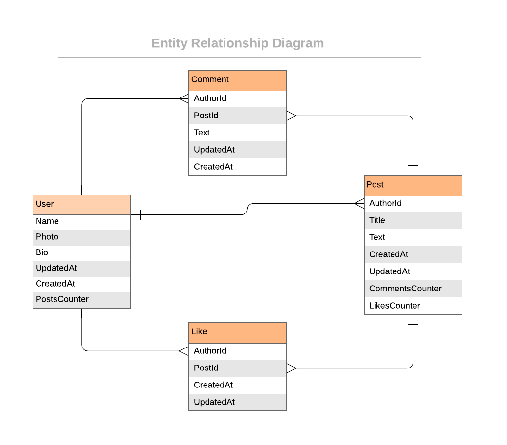

# Blog App

|  Blog App Project. That Built by using Ruby on Rails.
#
## Entity Relationship Diagram


# Built With
* Ruby on Rails
#
# Getting Started

To get a local copy up and running follow these simple example steps.

Clone this repository:
```
git clone git@github.com:aakbarkhan/Blogging.git
```
cd into folder:
```
cd Blogging
```

To get started, run following in the root directory:
```
gem install bundler
```
Install bundle

```
bundle install
```
Start Local Server
```
rails s
```
Run following to check linter errors:
```
rubocop
```
Auto fix the errors if available
```
rubocop -A
```
# For test:

Installation:
```
gem install rails -v "~> 3.0.0"
```
ADD this to your Gemfile
```
group :development, :test do
  gem 'rspec-rails'
end
```
Install the bundle
```
bundle install
```
Run Migraation
```
rails db:migrate
```
Run test
```
rspec spec
```

## Authors

👤 **aku** 
- GitHub: [@aakbarkhan](https://github.com/aakbarkhan)
- LinkedIn: [[LinkedIn]](https://www.linkedin.com/in/akuu-khan/)
  


## 🤝 Contributing

Contributions, issues, and feature requests are welcome!

Feel free to check the [issues page](../../issues/).

## Show your support

Give a ⭐️ if you like this project!

## Acknowledgments

- This project built in Microverse's fourth module's third week.

## 📝 License

This project is [MIT](./MIT.md) licensed.

